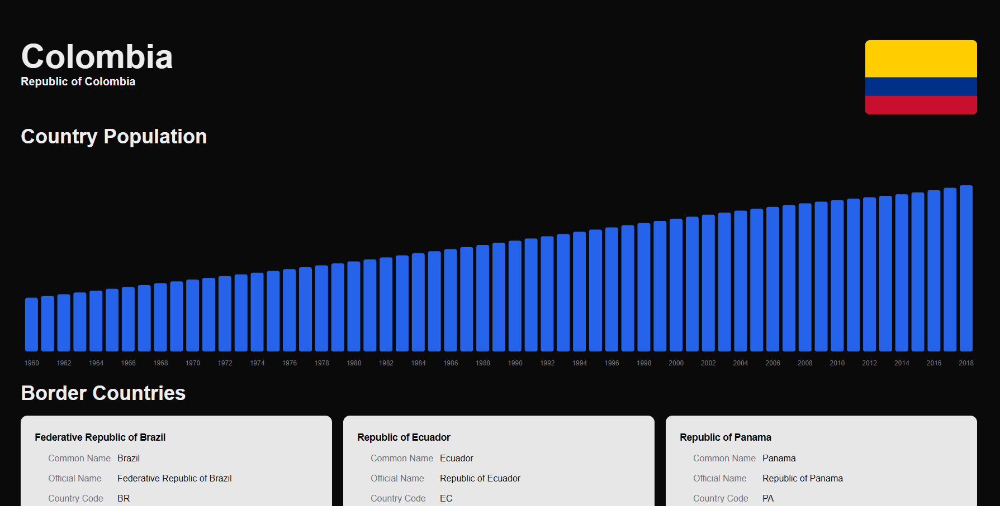
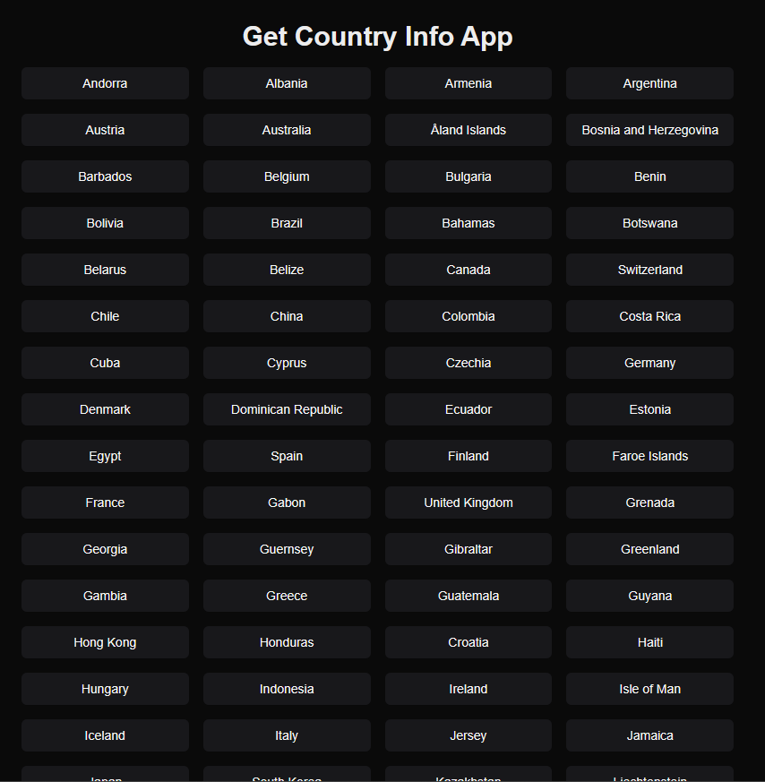

# Country Info App

<!-- insert image from assets -->




This app provides information about countries. In homepage you can see all available countries. In country page you can see information about selected country and its border countries. You can also see population chart and the flag of selected country fetch by API. In backend, use two api to get data: date.nager.com and countriesnow.space API.

## Frontend

- React and Next.Js
- TailwindCSS
- Typescript
- Shadcn UI
- React Query
- Recharts
- React-Icons

## Backend

- Nest.js
- Typescript
- Axios

## Run the Backend

_Need to rename .env.example to .env_

```bash
cd BE
mv .env.example .env
npm install
npm run start:dev
```

## Run Frontend

_Need to rename .env.example to .env_

```bash
cd FE
mv .env.example .env
npm install
npm run dev
```
